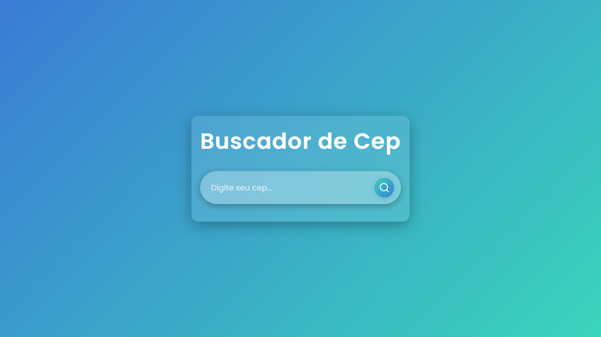
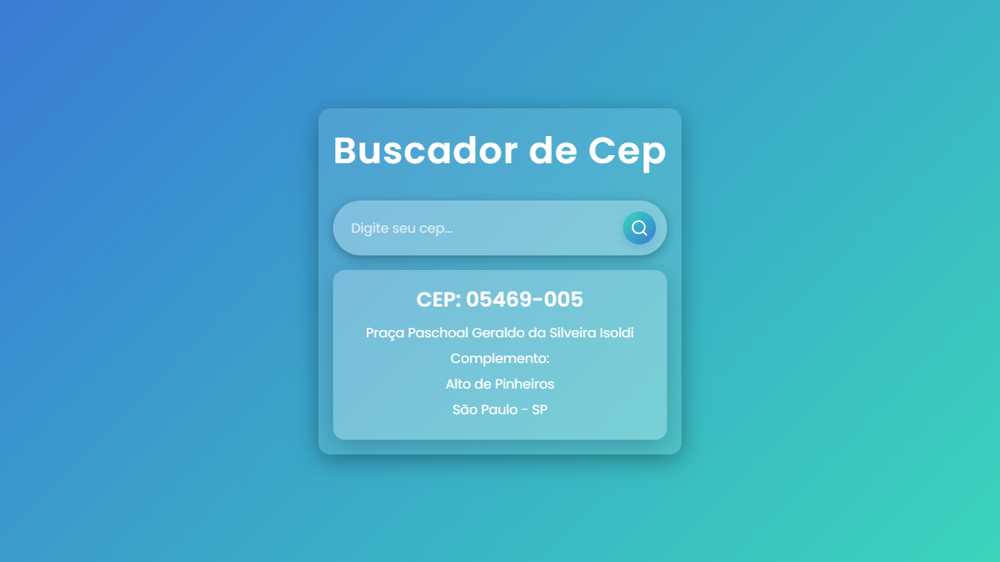

<div align="center">
  <h1>Buscador de CEP</h1>
</div>

## 📋 Descrição

O **Buscador de CEP** é uma aplicação web construída em React que permite consultar informações detalhadas a partir de um CEP válido. É uma ferramenta prática para obter dados como endereço completo e outras informações associadas ao CEP.

## 🚀 Funcionalidades

- Busca de CEP em tempo real.
- Exibição de dados como logradouro, complemento, bairro, cidade e estado.
- Validação de entrada para garantir que o usuário insira um CEP válido.
- Interface simples e responsiva.

## ✔️ Tecnologias Utilizadas

Este projeto foi desenvolvido utilizando as seguintes tecnologias:

<div align="center">
  
  
</div>

## 🛠️ Instalação e Execução

Siga os passos abaixo para rodar o projeto localmente:

1. Clone o repositório:
   ```bash
   git clone https://github.com/seu-usuario/buscador-cep.git
   ```

2. Acesse a pasta do projeto:
   ```bash
   cd buscador-cep
   ```

3. Instale as dependências:
   ```bash
   npm install
   ```

4. Inicie o servidor de desenvolvimento:
   ```bash
   npm start
   ```

5. Abra o navegador e acesse:
   [http://localhost:3000](http://localhost:3000)

## 🌐 Projeto em Produção

Você pode visualizar a versão em produção do projeto neste [link](https://buscador-cep-chi.vercel.app/).

## 🖼️ Imagens da Aplicação

<div align="center">
  
  
</div>

## 📚 Contato

Para mais informações ou perguntas, sinta-se à vontade para me contatar via [LinkedIn](https://www.linkedin.com/in/grazziano-fagundes/).

---

<div align="center">
  <small>Desenvolvido por Grazziano Borges Fagundes - 2024</small>
</div>
